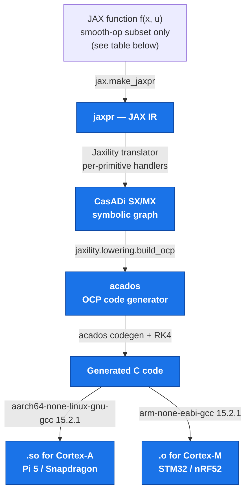
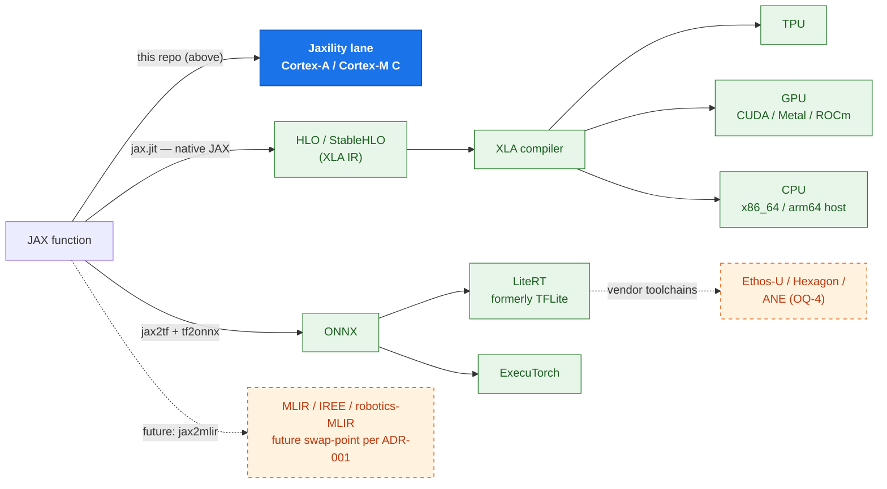

# Jaxility

Jaxility is the deployment-artifact compiler of a JAX-native robotics
stack. Hand it a calibrated robot (and optionally a trained policy) and
it lowers the controller's dynamics — JAX → CasADi → acados → C — into a
self-contained C project, then emits a signed attestation manifest that
binds the compiled binary back to the exact source it came from. What
you get is a deterministic MPC/WBC controller you can drop onto an
embedded target and verify end-to-end, from source to running binary.
The Cartpole example is verified closed-loop on a real Raspberry Pi 5 at
1 kHz.

Jaxility consumes calibrated robots from
[Jaxterity](https://github.com/machinavitalis/jaxterity), which itself
sits on top of
[Jaxonomy](https://github.com/machinavitalis/jaxonomy). Together they
form the three-package stack:

- **Jaxonomy** — the JAX simulation engine.
- **Jaxterity** — the robotics layer that produces calibrated robots.
- **Jaxility** — *this package*. Compiles calibrated robots and
  policies to embedded artifacts.

License: MIT. Commercial extras (hosted compilation, fleet update
orchestration, qualification packages, signed attestation as a service)
ship from a separate `jaxility-enterprise` repository.

## Quickstart

```bash
pip install jaxility

# Compile the Cartpole zoo entry to a host binary, end-to-end
jaxility build cartpole --target host --template LQR

# Walk a build's provenance chain: binary → manifest → source robot
jaxility verify path/to/manifest.json
```

```python
from jaxility import build

artifact = build(
    robot=calibrated_robot,   # a CalibratedRobot from Jaxterity
    target="pi5",             # Cortex-A76 profile
    template="LQR",
    template_options={"Q": Q, "R": R},
)
# artifact carries the binary bytes, the signed manifest, and the build log.
```

[`SKILL.md`](SKILL.md) is the full CLI/API guide (`build`, `verify`,
`bench`, `hil`, `targets`, `coverage`).

## What you can deploy today

The tables below are the human-readable quick reference. They are kept in
lockstep with the contract docs by an anti-drift test
(`test/unit/test_top_level_docs.py`), so what you read here is what the
code actually supports.

### Where Jaxility sits in the JAX-lowering landscape

A model trained in JAX has several possible lowering paths, depending
on what kind of artifact you need and what hardware it lands on.
**Jaxility owns one lane** — the smooth-dynamics → CasADi → acados →
embedded C path for deterministic MPC/WBC on Arm SoCs. The three
diagrams below separate that from the broader ecosystem instead of
crowding everything into one flow.

#### 1. Jaxility's lane (the main story)

This is the spine: JAX dynamics in, embedded C out, running on Pi 5
or a Cortex-M MCU. The full path is exercised end-to-end today
(Cortex-M locally + CI, Pi 5 in CI).



#### 2. The broader JAX-lowering ecosystem (what Jaxility does NOT own)

The same JAX function can also flow through three other lanes that
ship via different toolchains. **Jaxility's translator is one of
several options**, not the only one.



The standalone learned-policy lane — a policy that runs *alongside* the
acados controller, not embedded in the OCP — goes JAX → ONNX →
LiteRT/ExecuTorch on the right side of this diagram. Jaxility ships that
export + quantization + dual-path composition path, but the on-device NN
inference itself runs through LiteRT/ExecuTorch, not Jaxility's CasADi
lane.

#### 3. The L4CasADi sidetrack (one specific case only)

For the narrow case of **a learned function embedded inside the
OCP** — e.g. a neural-net cost-to-go evaluated every SQP iteration —
acados has an external-function FFI hook. [L4CasADi](https://github.com/Tim-Salzmann/l4casadi)
implements that hook for PyTorch models. ADR-017 weighed reusing
L4CasADi's FFI seam for this case but it was **not adopted** — the
dual-path composition Jaxility ships is tooling-agnostic and does not
embed a learned function inside the OCP.

This is a sidetrack — not part of Jaxility's main lane and not wired;
the L4CasADi seam remains an option a future embedded-learned-function
sub-lane could graft onto without changing the contract.

```mermaid
flowchart LR
    JAX["JAX policy / value function"]
    PT["Equivalent PyTorch model<br/>(or train torch directly)"]
    L4C["L4CasADi<br/>PyTorch → C++ shared lib"]
    ACADOS["acados OCP<br/>(Jaxility's main lane)"]

    JAX -.->|"jax2tf + tf2onnx<br/>+ onnx-to-torch"| PT
    PT -->|"trace + compile"| L4C
    L4C -->|"model_external_shared_lib_*<br/>FFI hook (ADR-017, not adopted)"| ACADOS

    classDef jaxility fill:#1a73e8,stroke:#0d47a1,color:#fff,font-weight:bold
    classDef solid fill:#e8f5e9,stroke:#2e7d32,color:#1b5e20
    classDef dotted fill:#fff3e0,stroke:#e65100,color:#bf360c,stroke-dasharray:5 5
    class ACADOS jaxility
    class L4C,PT solid
    class JAX dotted
```



**Legend across all three diagrams:**
- **Solid blue** — Jaxility owns this node today (or, in diagram 3,
  is the acados endpoint the sidetrack feeds into).
- **Solid green** — adjacent live tooling that ships through
  other projects (XLA, LiteRT, ExecuTorch, L4CasADi, jaxpr).
- **Dotted orange** — deferred, vendor-blocked, or proposed-only
  paths: MLIR → IREE (ADR-001 swap-point); Ethos-U / Hexagon / ANE
  vendor toolchains; the JAX → PyTorch hop in diagram 3 (no clean
  direct path, requires ONNX round-trip).

### When to use which path

| Goal | Path | Where it runs | Tool |
|---|---|---|---|
| Train + simulate at scale | JAX → jaxpr → XLA | TPU/GPU/CPU | `jax.jit` (native; not Jaxility) |
| Deterministic MPC/WBC on Pi 5 / Cortex-M | **JAX dynamics → Jaxility → CasADi → acados → C** | Cortex-A76 (Pi 5), Cortex-M4 | **Jaxility (this repo)** — Cartpole runs + HIL-verified + 1 kHz on a real Pi 5 |
| Learned policy alongside MPC | JAX → ONNX → LiteRT → on-device NN runtime | Same target as MPC | Jaxility (`jaxility.policy` export/quantization + `jaxility.compose` dual-path); NN inference via LiteRT |
| Learned value function *inside* the OCP | JAX → ONNX → torch → L4CasADi → acados FFI | Same target as MPC | L4CasADi seam (ADR-017 not adopted; not wired) |
| Deploy to TPU pod for batch inference | JAX → jaxpr → XLA → TPU | Google Cloud | Native JAX; out of Jaxility's scope |
| Deploy to Ethos-U55/65 NPU | JAX → ONNX → Vela compiler | Cortex-M55 + NPU | v0.2; vendor toolchain |
| Deploy to Qualcomm Hexagon NPU | JAX → ONNX → Hexagon SDK | RB3 Gen 2 / IQ10 | v0.2; vendor toolchain |

The full picture (with code citations and ADR pointers) lives in
[`CLAIMS.md`](CLAIMS.md) (what each lane guarantees today) and
[`KNOWN_GAPS.md`](KNOWN_GAPS.md) (which lanes are dotted-orange
above and why). [`AGENTS/DECISIONS.md`](AGENTS/DECISIONS.md) carries
the architectural ADRs — ADR-001 (CasADi as component), ADR-016 (no
MJX-as-source), and ADR-017 (L4CasADi for embedded learned
functions, Proposed) are the load-bearing ones for the diagram
above.

### Dynamics shapes you can hand to the translator

The translator (`jaxility.lowering.translate`) eats a JAX function and
walks its jaxpr. It accepts the **smooth-op subset** of JAX — the
operations the acados OCP transcription consumes without falling out
of its fixed-size SQP graph.

| Shape | Time domain | Status | Notes |
|---|---|---|---|
| ẋ = f(x, u), closed-form analytical | continuous | ✅ supported | The canonical case. acados RK4-integrates over the horizon; you write the right-hand side. Cartpole zoo entry is the worked example. |
| x[k+1] = f(x[k], u[k]) | discrete | ✅ supported | Next-state map as a smooth function. |
| Discrete state-space, IIR/FIR filters, fixed-form polynomials, coordinate transforms | static / discrete | ✅ supported | Composition of supported primitives below. |
| Rigid-body dynamics from Jaxterity `Robot.build_system` (MJX-backed) | continuous | ❌ not supported | MJX runs the constraint solver under `lax.while_loop` unconditionally, which can't unroll into acados' fixed-size SQP graph (ADR-016). Workaround: supply closed-form per-robot dynamics. |
| Implicit dynamics, DAEs, Newton iteration in source | continuous | ❌ not supported | Same root cause — an in-source fixpoint needs `while_loop`. |
| Hybrid / mode-switched dynamics | hybrid | ❌ not supported | Mode dispatch is `lax.cond[traced]` — non-smooth, so SQP can't linearise it. Workaround: smoothing approximation. |
| Stochastic dynamics (SDEs, `jax.random`) | continuous | ❌ not supported | Out of scope by design — the acados OCP is deterministic. |

### Supported JAX primitives (smooth-op subset)

| Category | Primitives | Status |
|---|---|---|
| Arithmetic | `add`, `sub`, `mul`, `div`, `neg`, `integer_pow`, `pow` | ✅ |
| Transcendentals | `jnp.sin`, `jnp.cos`, `jnp.tan`, `jnp.exp`, `jnp.log`, `jnp.sqrt` | ✅ |
| Linear algebra | `dot_general` (matmul + tensor contractions) | ✅ |
| Indexing (compile-time) | `slice`, `dynamic_slice` with literal start indices, rank ≤ 2 | ✅ |
| Shape ops | `broadcast_in_dim`, `squeeze`, `concatenate`, `reshape`, `transpose`, `convert_element_type` | ✅ |
| Control flow | `select_n` / `jnp.where` over a **literal** predicate; `jit` (transparent recursion) | ✅ |
| Non-smooth control flow | `lax.cond[traced]`, `jnp.where[traced]`, `lax.while_loop`, `lax.scan`, `dynamic_slice[traced]`, `dynamic_update_slice` | ❌ |
| Saturation / min / max / abs / sign / step | — | ❌ non-smooth; use sigmoid / softplus |

Authoritative list: `jaxility.lowering.coverage.COVERAGE_TABLE` and the
`@_register` decorators in `jaxility/lowering/jax_to_casadi.py`.

### Controllers (acados templates)

A template is a parameterised control law that Jaxility instantiates
against your robot's dynamics and codegens through acados — you pick one
at build time (`--template LQR`) and supply its cost/weight parameters,
rather than hand-writing the OCP. These four ship today; each maps to a
factory under `jaxility.templates`.

| Template | Status | Notes |
|---|---|---|
| **LQR** — finite-horizon discrete LQR with linearised dynamics | ✅ shipped | `jaxility.templates.lqr` |
| **TrackingMPC** — reference-following with quadratic stage + terminal cost | ✅ shipped | `jaxility.templates.tracking_mpc` |
| **WBC (weighted, non-hierarchical)** — task priorities as relative cost weights | ✅ shipped | `jaxility.templates.wbc`; hierarchical WBC is later work |
| **Centroidal MPC (single-contact)** | ✅ shipped | `jaxility.templates.centroidal_mpc`; multi-contact deferred |
| Learned-policy lane (JAX → ONNX → LiteRT/ExecuTorch) | ✅ shipped | `jaxility.policy` (ONNX export, LiteRT/ExecuTorch, quantization) + `jaxility.compose` (dual-path composition + attestation) |

### Targets

Fourteen `Target` profiles ship today, all data-only (capability flags,
toolchain pin, NPU capability, memory budget, RT class, quirks). Hash
distinctness verified across the full set (invariant 5).

| Profile | Family | Toolchain | NPU | Realtime |
|---|---|---|---|---|
| `PI5` | cortex-a76 | `aarch64-none-linux-gnu-gcc 15.2.1` | — | SOFT, PREEMPT_RT |
| `CORTEX_A55` | cortex-a55 | `aarch64-none-linux-gnu-gcc 15.2.1` | — | SOFT, PREEMPT_RT |
| `CORTEX_A78` | cortex-a78 | `aarch64-none-linux-gnu-gcc 15.2.1` | — | SOFT, PREEMPT_RT |
| `CORTEX_A710` | cortex-a710 | `aarch64-none-linux-gnu-gcc 15.2.1` | — | SOFT, PREEMPT_RT |
| `NEOVERSE_N1` | neoverse-n1 | `aarch64-none-linux-gnu-gcc 15.2.1` | — | SOFT, PREEMPT_RT |
| `CORTEX_M4` | cortex-m4 | `arm-none-eabi-gcc 15.2.1` | — | HARD, cyclic |
| `ETHOS_U55` | ethos-u55 | `arm-none-eabi-gcc 15.2.1` | Ethos-U55 (0.5 TOPS @ INT8) | HARD, cyclic |
| `ETHOS_U65` | ethos-u65 | `arm-none-eabi-gcc 15.2.1` | Ethos-U65 (1.0 TOPS @ INT8) | HARD, cyclic |
| `QUALCOMM_IQ10` | qualcomm-iq10 | `aarch64-none-linux-gnu-gcc 15.2.1` | Hexagon (≈12 TOPS @ INT8) | SOFT, PREEMPT_RT |
| `APPLE_SILICON` | apple-silicon | `clang 15.0.0` | ANE (pending OQ-4) | NONE |
| `HOST_DARWIN` | host-darwin | clang | — | NONE |
| `HOST_LINUX` | host-linux | gcc | — | NONE |
| `MOCK_CORTEX_A` | mock-cortex-a | mock | — | SOFT, PREEMPT_RT |
| `MOCK_CORTEX_M` | mock-cortex-m | mock | — | HARD, cyclic |

Profiles are data; what actually builds and runs today is narrower: the
**host path** is fully end-to-end (compile → load → step), the **Pi 5
controller** runs HIL-verified and benchmarked on real silicon (native
and cross-compiled), and the **Cortex-M** lane produces the `.o` today
(linker scripts + startup files are next). Only Cortex-A76, M4, and
Ethos-U55/65 are wired into the compiler flags — adding a family is a
single PR, and unwired families loud-fail rather than mis-build.

### Manifest

Every build emits a signed manifest: a frozen, schema-versioned record
(Pydantic v2) with a BLAKE3 hash chain (ADR-005) linking the binary to
its source robot, plus pinned toolchain versions. It is byte-deterministic
across rebuilds and fails loud on any unverified toolchain pin — so
`jaxility verify` can re-derive the whole provenance chain offline.

### For the full picture

- [`CLAIMS.md`](CLAIMS.md) — the exhaustive list of what Jaxility
  guarantees, with code citations.
- [`KNOWN_GAPS.md`](KNOWN_GAPS.md) — the symmetric list of what
  Jaxility explicitly does not do, with workarounds and ADR
  pointers.
- [`AGENTS/CONTEXT.md`](AGENTS/CONTEXT.md) — architectural
  orientation.
- [`AGENTS/DECISIONS.md`](AGENTS/DECISIONS.md) — the ADR log
  (16 ADRs).
- [`CHANGELOG.md`](CHANGELOG.md) — what shipped, grouped by theme.
